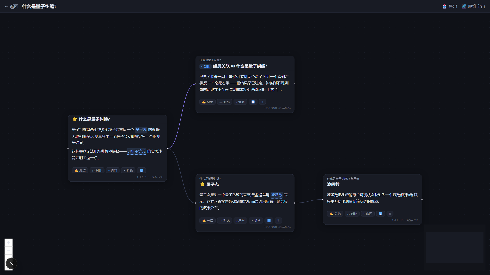
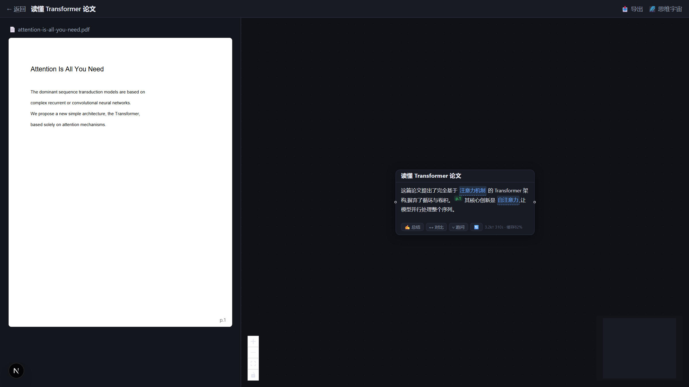
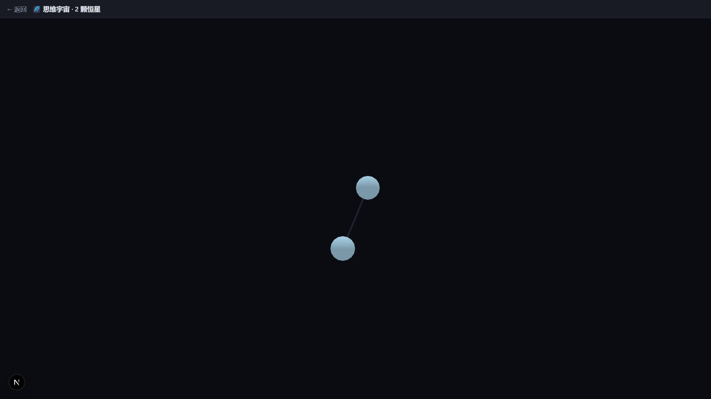

<div align="center">

# Explore 🌲

**哪里不懂点哪里 —— 让知识长成一棵树**

*A hierarchical knowledge-exploration agent: click any term you don't understand,<br>and watch your knowledge grow into a tree — powered by Claude.*

[](https://github.com/zhuge-Tom/explore/actions/workflows/ci.yml)
[](LICENSE)
[](https://nextjs.org)
[](https://platform.claude.com)

[English](README.en.md)

</div>

---

## 为什么做这个?

在和 AI 探讨复杂问题(读论文、学生物、研究量子力学)时,你是否经常遇到:

> 问了一个问题 ➡️ AI 抛出 10 个不懂的术语 ➡️ 追问其中一个 ➡️ 回答里又有新术语……
> 聊了三轮之后,你和 AI 都忘了最开始在聊什么 😵‍💫

面对海量知识,我们却还在用半个世纪前的"命令行对话框"交互。**Explore 用「卡片树」替代「聊天流」**:每一次追问都在画布上长出一张新卡片,主线永远清晰可见。

## ✨ 核心功能

### 层级对话 —— 哪里不懂点哪里

卡片里看不懂的术语会自动高亮,点击即在旁边展开新卡片。上下文自动继承(祖先链摘要),永远不用复述"我们刚才聊到哪了"。



- ↗️ **子卡片**:点击术语,深挖背景知识
- ↔ **对比卡片**:与易混概念横向辨析(紫色连线)
- ⑂ **分支追问**:继承上下文,换个角度另起炉灶(虚线连线)
- 流式生成、自动布局、面包屑路径、同名去重跳转、折叠聚焦、一键导出 Markdown 笔记

### 文献模式 —— 在论文上直接提问

导入 PDF 进入双栏模式:左侧读原文,**选中不懂的内容直接提问**;卡片回答自带页码引用角标,点击跳回原文位置。



### 思维宇宙 —— 让理解沉淀下来

读懂一张卡片后,**用自己的话总结**。AI 从准确性、完整性、是否用自己的话三个维度评审:通过则成为你 3D 思维宇宙中的一颗恒星;未通过则指出具体偏差(给线索,不给答案)。

未来生成新卡片时,AI 会检索你已内化的理解,**用"你自己说过的话"来教你新概念**。



## 🚀 快速开始

```bash
git clone https://github.com/zhuge-Tom/explore.git
cd explore/explore
npm install          # 自动执行 prisma generate
npm run db:push      # 初始化 SQLite 数据库(零配置)
npm run dev          # http://localhost:3000
```

打开首页,在 **「⚙️ 设置」** 面板中填入你的 [Anthropic API Key](https://platform.claude.com/)(保存即时生效,支持一键测试连接)。Windows 用户也可以直接双击 `explore/start.bat`。

> 可选:填入 [Voyage AI](https://www.voyageai.com/) Key 可解锁思维宇宙的语义连线与知识锚点教学;不填则自动降级,其余功能不受影响。

## 🧠 LLM 工程亮点

| 设计 | 说明 |
|---|---|
| **Prompt 分层缓存** | 系统提示词(1h)→ 文献(1h)→ 分支上下文(5m)→ 指令,沿分支深挖时只为增量付费,卡片底部实时显示缓存命中率 |
| **祖先链摘要** | 每张卡片异步预压缩学习路径摘要,10 层深的树也是 O(1) 上下文组装 |
| **正文即协议** | 卡片用 `[[术语\|预览]]` 内联标记,流式渲染与结构化解析兼得 |
| **结构化评审** | 思维宇宙评审走 `json_schema` 结构化输出,evidence 可解析可落库 |
| **成本保护** | 每日配额 + 并发限制 + 用量看板(tokens / 缓存命中 / 估算成本) |
| **稳健性** | refusal 服务端兜底、SSE 断线补齐、失败重试、友好中文报错 |

## 📚 文档

| 文档 | 内容 |
|---|---|
| [01-产品设计](01-产品设计.md) | 用户旅程、卡片系统、思维宇宙产品规则 |
| [02-系统架构](02-系统架构.md) | 技术选型、模块划分、关键链路 |
| [03-数据模型与API](03-数据模型与API.md) | Schema、REST/SSE 接口定义 |
| [04-LLM工程设计](04-LLM工程设计.md) | Prompt 设计、缓存策略、评审规范 |
| [05-MVP路线图](05-MVP路线图.md) | 三阶段迭代计划与验收标准 |
| [explore/README.md](explore/README.md) | 开发细节:目录结构、测试、已知约束 |

## 🛠️ 技术栈

Next.js 16 · React Flow · react-pdf · react-force-graph-3d · Prisma + SQLite · [@anthropic-ai/sdk](https://github.com/anthropics/anthropic-sdk-typescript)(`claude-opus-5`)· Voyage AI(可选)· Playwright E2E

## 📄 License

[MIT](LICENSE) © 2026 zhuge-Tom
