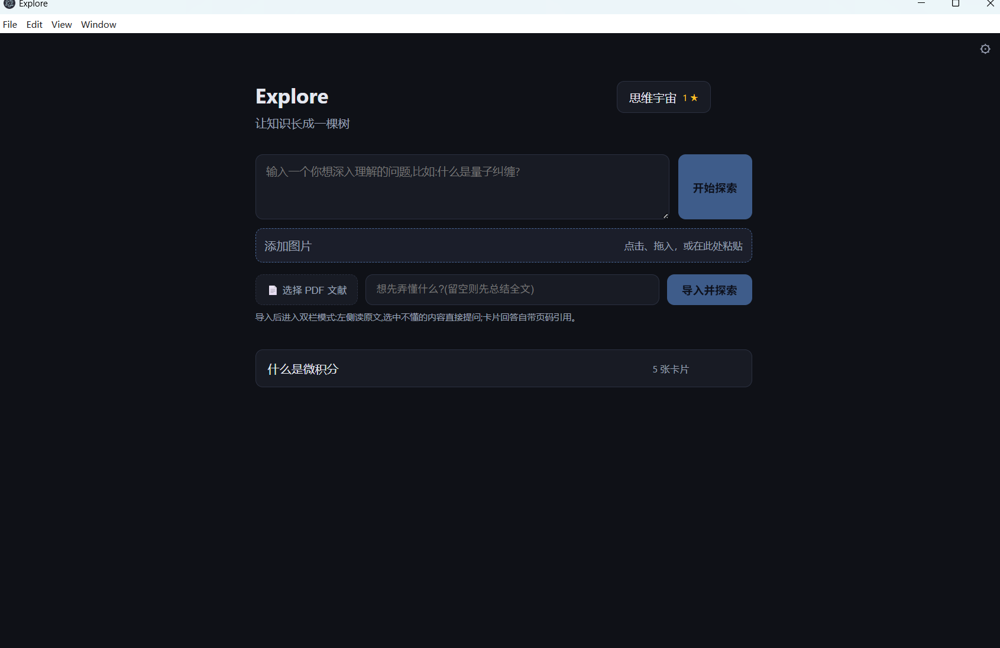
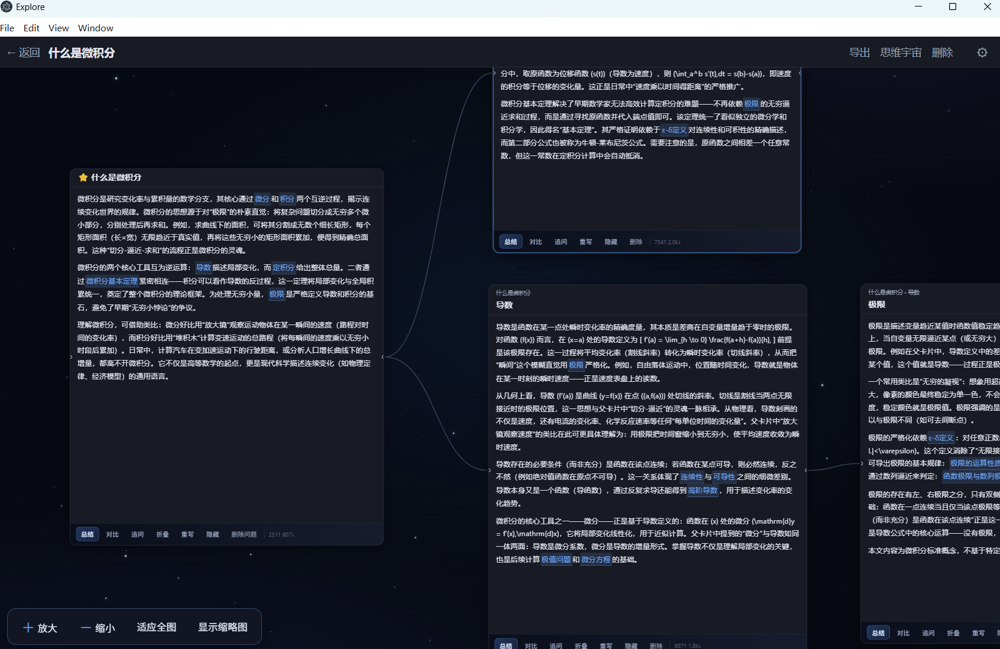
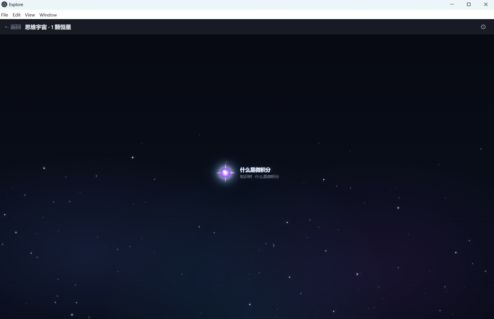

# Explore

Explore 是一个 Windows 桌面知识探索工具。它把问题、图片或 PDF 文献拆解为可以继续展开的知识卡片，并用无限画布和思维宇宙保存学习过程。

适合把一个模糊的问题逐步梳理成自己的知识结构，而不是一次性获得一段答案。

## 下载与安装

从 [Releases](https://github.com/zhuge-Tom/explore/releases/latest) 下载最新的 `Explore.Setup.x.y.z.exe`，双击后按提示选择安装位置即可。安装程序会创建桌面与开始菜单入口。

当前最新版为 [v0.2.0](https://github.com/zhuge-Tom/explore/releases/tag/v0.2.0)。

应用数据位于：

```text
%APPDATA%\Explore
```

卸载或升级应用不会自动移除已有的知识树、PDF 和设置。

## 使用方式

### 从问题、图片或 PDF 开始

输入一个想理解的问题即可开始。也可以点击添加图片、将图片拖入输入区，或直接粘贴截图；支持导入带文本层的 PDF，并在阅读原文时继续提问。



### 在无限画布中组织知识

生成的卡片可以整体拖动，也可以从四边和四角调整大小。卡片支持展开术语、横向对比、追问、折叠、隐藏、重写和删除；画布提供缩放、全图适配与缩略图控制。



### 将真正理解的内容沉淀为恒星

用自己的话总结卡片内容。通过 AI 评审后，相应知识会成为思维宇宙中的一颗恒星；点击恒星可回看对应的知识点。



## 模型设置

首次启动时，或点击右上角的设置按钮，选择要配置的模块：

- 文字对话：用于问题、卡片、总结评审等文字任务。
- 识图模型：只在附图提问时调用，和文字模型的 API Key、服务地址、模型名完全分开。

文字对话支持 DeepSeek、Anthropic 与自定义 OpenAI Chat Completions 兼容服务。识图模型提供以下预设，也可填写兼容接口：

- 智谱 GLM-4V-Flash
- SiliconFlow Qwen2.5-VL
- Ollama `qwen3-vl:8b`
- OpenAI `gpt-4o-mini`
- Anthropic Claude

点击“加载模型”可读取服务端返回的模型列表；点击“保存并测试”后才会写入配置。API Key 存储在 Windows 凭据管理器中，设置接口不会返回 Key 内容。

## 功能概览

- 流式生成 Markdown 知识卡片，并支持卡片内文字选中与复制。
- 图片提问：选择、拖拽或粘贴 PNG、JPEG、WebP、GIF 图片。
- PDF 本地逐页提取文本；回答使用 `[[page:N]]` 标记页码引用。
- 知识树画布：拖动、缩放、折叠、隐藏、删除和重新生成。
- 思维宇宙：通过评审的理解会沉淀为带标签、可点击的恒星。
- 随机分布、闪烁的星空画布背景。

## 本地开发

需要 Node.js 22 和 npm。

```powershell
cd explore
npm install
npm run db:push
npm run dev
```

开发页面默认位于 <http://localhost:3000>。也可使用仅含 ASCII 字符的启动脚本：

```powershell
.\start.bat
```

## 构建 Windows 安装包

```powershell
cd explore
npm ci
npm run desktop:build
```

安装包输出到：

```text
explore\dist\Explore Setup x.y.z.exe
```

桌面版由 Electron 启动本地 Next.js 服务，只监听随机的 `127.0.0.1` 端口，无需用户另开浏览器。

## 隐私与边界

- 仓库与安装包不包含 API Key、个人数据库或上传文件。
- 图片和 PDF 保存在本机数据目录；只有在发起相应提问时才会发送给你配置的模型服务。
- 扫描型 PDF 暂不提供 OCR；没有文本层时应用会提示更换文件。
- 当前版本不提供云同步、账号系统、多设备共享或自动更新。
